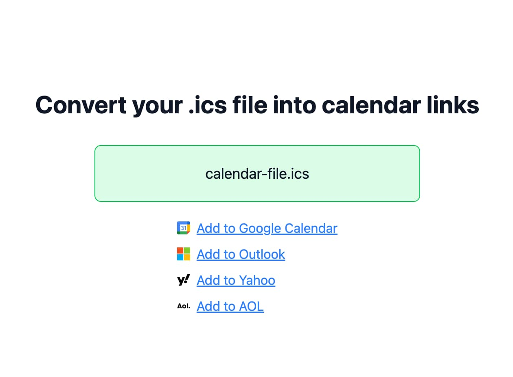

# ics-to-link

An application to generate calendar links from ICS files. Everything is done in the browser, no data is sent to any server.

https://illright.github.io/ics-to-link/

## License

ISC, [explained](https://choosealicense.com/licenses/isc/).
